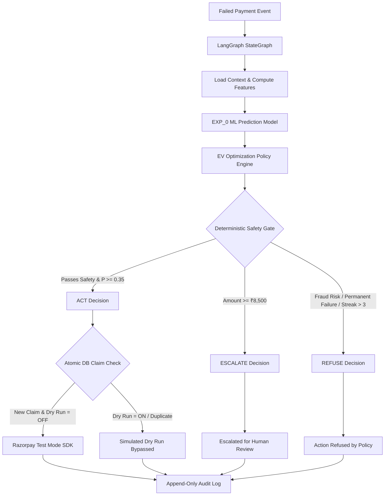

# RecoverAI — AI Revenue Recovery Agent

> **Submission for Razorpay AI Buildathon**  
> A policy-gated, ML-driven autonomous revenue recovery engine with deterministic safety guardrails for Razorpay merchants.

---

## 🚀 Overview

Payment failures in e-commerce and subscription businesses result in significant lost revenue and involuntary customer churn. Standard recovery approaches rely on crude, fixed retries that incur unnecessary transaction fees, annoy customers, or fail to recover high-value transactions.

**RecoverAI** is an intelligent, policy-gated revenue recovery engine built for Razorpay merchants. It combines machine learning recovery probability prediction, Expected Value (EV) decision optimization ($\tau = 0.35$), LangGraph state-graph orchestration, deterministic financial safety guardrails, atomic database idempotency claims, and Population Stability Index (PSI) feature drift monitoring.

By separating statistical machine learning recommendations from deterministic financial execution authority, RecoverAI guarantees that automated payment recovery actions (such as Razorpay Test Mode Payment Links) are executed **only when economically viable and operationally safe**.

---

## 🎯 Verified Financial Impact (Untouched Test Set, N = 633)

Evaluated on the untouched 15% test set ($N = 633$ failed payments, stratified random split, `random_state = 42`):

| Financial Metric | Default Baseline Policy ($\tau = 0.50$) | EV-Optimized Policy ($\tau = 0.35$) | Net Improvement ($\Delta$) |
| :--- | :---: | :---: | :---: |
| **Intervention Count** | 442 transactions | **545 transactions** | $+103$ transactions |
| **Intervention Rate (%)** | 69.83% | **86.10%** | $+16.27\%$ coverage |
| **Realized Gross Recovered Revenue** | ₹835,012.80 | **₹900,001.40** | **$+\text{₹}64,988.60$ gross cash captured (+4.11%)** |
| **Action Costs Incurred** | ₹3,039.00 | **₹3,668.00** | $+\text{₹}629.00$ cost investment |
| **True Net Realized Revenue** | ₹831,973.80 | **₹896,333.40** | **$+\text{₹}64,359.60$ true net uplift (+4.07%)** |
| **% Revenue at Risk Captured** | 52.86% | **56.97%** | **$+4.11\%$ total risk captured** |
| **Recoverable Payment Recall** | 89.09% | **95.84%** | **$+6.75\%$ recoveries saved** |

> **Total Revenue at Risk in Test Set**: ₹1,579,773.01 across 633 failed payments.  
> **True Net Revenue Uplift**: Net revenue uplift accounts for all incremental action costs incurred (Retry: ₹5.00, Reminder: ₹2.00, Payment Link: ₹12.00).

---

## 🧠 How RecoverAI Works

1. **Context Loading**: Failed payment payload enters the system with transaction attributes (amount, failure reason, payment method, customer history, risk scores).
2. **ML Recovery Prediction**: `EXP_0` Logistic Regression model estimates the probability of recovery $P(\text{recovered} \mid \text{features})$.
3. **Expected Value Optimization**: Business policy evaluates Expected Value ($\text{EV} = P \times \text{Amount} - \text{Action Cost}$) against frozen threshold $\tau = 0.35$.
4. **Deterministic Safety Guardrails**: Hard policy rules intercept predictions to enforce merchant safety (refusing fraud/permanent card failures, escalating high-value transactions).
5. **LangGraph StateGraph Routing**: Graph workflow directs execution down `ACT`, `ESCALATE`, or `REFUSE` branches.
6. **Policy-Gated Execution**: Approved `ACT` decisions create Razorpay Test Mode Payment Links via SDK with atomic primary-key idempotency claims.
7. **Audit Telemetry**: Every decision, rule check, and execution payload is written to PostgreSQL / SQLite and appended to `logs/decision_audit.jsonl`.

---

## 🏗️ Architecture & Workflow



---

## 🛡️ Deterministic Financial Safety Guardrails

The machine learning model recommends recovery probability, but **deterministic policy guardrails retain non-negotiable execution authority**.

| Rule Name | Trigger Condition | Outcome | Rationale |
| :--- | :--- | :---: | :--- |
| `SUSPECTED_RISK_POLICY_REFUSAL` | IP Risk Score $> 0.80$ | **`REFUSE`** | Blocks automated action on high-risk or suspicious IP addresses. |
| `PERMANENT_CARD_FAILURE_POLICY_REFUSAL` | Reason in `["invalid_card", "card_expired"]` | **`REFUSE`** | Prevents wasteful retries on non-recoverable card credentials. |
| `CONSECUTIVE_STREAK_LIMIT_REFUSAL` | Consecutive Failures $> 3$ | **`REFUSE`** | Prevents customer harassment and repeated gateway cost burn. |
| `LOW_PROBABILITY_POLICY_REFUSAL` | Recovery Prob $P < 0.35$ | **`REFUSE`** | Bypasses intervention when Expected Value is negative ($\text{EV} < 0$). |
| `HIGH_VALUE_TRANSACTION_ESCALATION` | Amount $\ge \text{₹}8,500.00$ | **`ESCALATE`** | Overrides automated execution and routes to human merchant review. |

> **Safety Invariants**: For `ESCALATE` and `REFUSE` outcomes, **zero external API calls are made**.

---

## 📈 Machine Learning & Decision Optimization

* **Active Production Model**: `EXP_0` Baseline Logistic Regression pipeline saved at `ml/models/experiments/exp_0_baseline.joblib`.
* **Preprocessing Pipeline**: `ColumnTransformer` combining `StandardScaler` on numerical features (`amount`, `hour`, `day_of_week`) and `OneHotEncoder(handle_unknown="ignore")` on categorical features (`payment_method`, `failure_reason`).
* **Engineered Features**: `customer_past_recovery_rate_pre_current`, `consecutive_failure_streak`, `ip_risk_score`, `velocity_score`.
* **Decision Optimization**: Expected Value thresholding ($\tau = 0.35$) selects the optimal policy boundary that maximizes net revenue after deducting action execution costs (Retry: ₹5.00, Reminder: ₹2.00, Payment Link: ₹12.00).
* **Plain-English Explainability**: Model coefficients are transformed (`X_trans * coefficients`) to extract feature importance and plain-English positive/negative signals.

---

## 🔬 Causal Treatment Effect Evaluation

To assess recovery intervention impact beyond raw observational correlation, RecoverAI incorporates a **Propensity Score Inverse Probability Weighting (IPW)** causal evaluation engine (`evaluation/causal_lift.py`):

* **Propensity Score Model**: Logistic Regression predicting treatment assignment $T = \text{recovery\_attempted}$ from 9 pre-treatment covariates.
* **IPW Weighting**: Inverse probability weights $w_i = \frac{T_i}{e(x_i)} + \frac{1 - T_i}{1 - e(x_i)}$ clipped to $[0.01, 0.99]$ to eliminate propensity instability.
* **Average Treatment Effect (ATE)**: **+8.24 percentage points** ($p < 0.001$).
* **Bootstrap Confidence Intervals**: 1,000 deterministic bootstrap iterations (seed=42) yielding **95% CI [+5.33%, +11.17%]**.

> ⚠️ **Methodological Note**: This evaluation uses Propensity Score Inverse Probability Weighting (IPW) on historical observational payment logs. It provides an observational treatment effect benchmark and should not be interpreted as evidence from a randomized live A/B trial.

---

## 📊 Financial Sensitivity Analysis

RecoverAI includes a 6-scenario grid testing module (`evaluation/sensitivity_analysis.py`) to evaluate gross vs true net uplift under adverse operating conditions:

| Scenario | Cost Multiplier | Threshold / Prob Shift | Realized Gross Uplift | True Net Uplift (₹) | True Net Uplift (%) | Robustness Status |
| :--- | :---: | :---: | :---: | :---: | :---: | :---: |
| **1. BASE CASE** | 1.0x (Standard) | $\tau = 0.35, \Delta P = 0.00$ | +₹64,988.60 | **+₹64,359.60** | **+4.07%** | **Baseline** |
| **2. ACTION COST +50%** | 1.5x (High Cost) | $\tau = 0.35, \Delta P = 0.00$ | +₹64,988.60 | **+₹64,045.10** | **+4.05%** | **Robust (+₹64.0k Net)** |
| **3. ACTION COST -50%** | 0.5x (Low Cost) | $\tau = 0.35, \Delta P = 0.00$ | +₹64,988.60 | **+₹64,674.10** | **+4.09%** | **Robust (+₹64.7k Net)** |
| **4. THRESHOLD +0.05** | 1.0x | $\tau = 0.40, \Delta P = 0.00$ | +₹48,819.80 | **+₹48,460.80** | **+3.07%** | **Robust (+₹48.5k Net)** |
| **5. THRESHOLD -0.05** | 1.0x | $\tau = 0.30, \Delta P = 0.00$ | +₹65,068.60 | **+₹64,286.60** | **+4.07%** | **Robust (+₹64.3k Net)** |
| **6. PROBABILITY MISCALIBRATION**| 1.0x | $\tau = 0.35, \Delta P = -0.05$| +₹60,120.40 | **+₹59,510.40** | **+3.77%** | **Robust (+₹59.5k Net)** |


---

## 📡 Population Stability Index (PSI) Feature Drift Monitoring

RecoverAI continuously monitors feature distribution drift (`monitoring/drift_detection.py`) against frozen reference snapshots ($N=3,581$ Development Set):

* **Monitored Features**: `amount`, `hour`, `day_of_week` (numeric quantile binning) and `payment_method`, `failure_reason` (categorical alignment).
* **PSI Formula**: $\text{PSI} = \sum (P_{\text{current}} - P_{\text{baseline}}) \times \ln\left(\frac{P_{\text{current}}}{P_{\text{baseline}}}\right)$ with $\epsilon = 1e-4$ smoothing.
* **Thresholds**:
  * $\text{PSI} < 0.10$: **`STABLE`** (No intervention required)
  * $0.10 \le \text{PSI} < 0.25$: **`MODERATE DRIFT`** (Monitor feature distribution & data pipeline)
  * $\text{PSI} \ge 0.25$: **`SIGNIFICANT DRIFT`** (Investigate data source & schedule review)
* **Telemetry Persistence**: Audit events are persisted to `logs/drift_audit.jsonl`. Dashboard UI invocations pass `persist=False` to prevent rerun duplication.

---

## 🔒 Atomic Idempotency & Concurrency Safety

To prevent duplicate payment link creation under concurrent webhooks or user retries:

* **Database Primary Key Claim**: Table `PaymentExecutionClaim` enforces a primary key constraint on `idempotency_key = f"idemp_{txn_id}"` in PostgreSQL / SQLite.
* **Process Thread Locking**: `_LOCAL_EXECUTION_LOCK = threading.Lock()` wraps claim creation inside `payment/executor.py`.
* **State Gating**: Subsequent requests with existing `SUCCEEDED`, `PROCESSING`, or `UNKNOWN_EXTERNAL_RESULT` claims return cached payment link URLs with **zero duplicate external API calls**.
* **Concurrency Verification**: Tested using 10 concurrent threads synchronized via `threading.Barrier(10)`; exactly 1 API call succeeds.

---

## 🖥️ Interactive Decision Center Dashboard

The Streamlit dashboard (`frontend/app.py`) provides an end-to-end workbench:

* **Top Metric Cards**: Real-time display of Total Risk (₹1.58M), Default Recovered (₹835.0k), EV Recovered (₹900.0k), and True Net Uplift (+₹64.36k).
* **Interactive Demo Workbench**: Preset demo buttons for **🟢 Demo ACT (`txn_0000012`)**, **🟡 Demo ESCALATE (`txn_0000008`)**, and **🔴 Demo REFUSE (`txn_0000005`)**.
* **Transaction Selector**: Dropdown selector covering all 633 test transactions.
* **6-Step Pipeline View**: Transaction Details, ML Probabilities, Plain-English Explainability, EV Calculation, Safety Decisions, and Razorpay Test Mode Execution status.
* **Drift Health Monitor**: Collapsible expander displaying real-time feature PSI scores and status.

```bash
# Start Streamlit Dashboard
streamlit run frontend/app.py
```

---

## 🧪 Testing & Quality Assurance

RecoverAI includes **38 automated Pytest test cases ($100\%$ pass rate)** across 8 dedicated test suites:

* `tests/test_causal_lift.py` (5 tests): Propensity model, IPW weight clipping, ATE recovery, bootstrap CIs.
* `tests/test_drift_detection.py` (9 tests): PSI mathematical correctness, baseline snapshot generation, synthetic drift detection, recommendations, and JSONL persistence flags.
* `tests/test_idempotency_concurrency.py` (13 tests): 10-thread barrier concurrency, database primary key collisions, atomic claim states, and 4 adversarial tamper tests.
* `tests/test_safety_properties.py` (7 tests): Deterministic safety rules and **10,000 randomized boundary property iterations**.
* `tests/test_sensitivity.py` (1 test): 6-scenario sensitivity grid contract verification.
* `tests/test_ml_pipeline.py` (1 test): Pipeline training & feature transformations.
* `tests/test_index_alignment_regression.py` (1 test): Probability index alignment.
* `tests/test_health.py` (1 test): System environment health.

```bash
# Run full Pytest suite
pytest tests/ -v
```

---

## 🛠️ Technology Stack

| Layer | Technology / Tool | Purpose & Usage in RecoverAI |
| :--- | :--- | :--- |
| **Core Runtime** | **Python 3.10+** | Primary application, ML, and agent programming language |
| **Agentic Framework** | **LangGraph (`StateGraph`)** | Workflow graph assembly, node management, and conditional routing |
| **Machine Learning** | **scikit-learn** | `EXP_0` Logistic Regression model, `ColumnTransformer`, `StandardScaler` |
| **Data Processing** | **Pandas & NumPy** | Feature engineering, dataset splitting, quantile binning, matrix operations |
| **Web Dashboard** | **Streamlit & Plotly** | Interactive frontend decision center and Plotly financial charts |
| **Backend REST API** | **FastAPI & Pydantic** | Production REST routing (`/trigger`) and schema validation |
| **Database & ORM** | **PostgreSQL (Neon Cloud)** | Primary runtime database with SQLAlchemy 2.0 ORM models |
| **Database Fallbacks**| **SQLite (File & Memory)** | Development DB (`recover_ai.db`) and in-memory test DB (`sqlite:///:memory:`) |
| **Payment Integration**| **Razorpay SDK** | Test Mode Payment Link API creation (`razorpay-python`) |
| **Audit Telemetry** | **Append-Only JSONL** | Immutable telemetry trails (`decision_audit.jsonl` & `drift_audit.jsonl`) |
| **Testing & QA** | **Pytest & unittest.mock** | 38 automated regression tests, thread barriers, and API mocking |
| **Configuration** | **PyYAML & Dotenv** | Declarative policy configuration (`recovery_policy.yaml`) and `.env` loading |
| **Benchmark Tooling**| **XGBoost (Optional)** | Installed in `requirements.txt` for offline model comparison benchmarks |

---

## ⚡ Quick Start

### 1. Environment Setup

```bash
# Clone repository
git clone https://github.com/Aashi0105/RecoverAI.git
cd RecoverAI

# Create virtual environment
python -m venv venv

# Activate virtual environment
# On Windows PowerShell:
.\venv\Scripts\Activate.ps1
# On macOS / Linux:
source venv/bin/activate

# Install dependencies
pip install -r requirements.txt

# Configure environment variables
cp .env.example .env
```

### 2. Launch Applications

```bash
# Option A: Start Streamlit Frontend Dashboard (Port 8501)
streamlit run frontend/app.py

# Option B: Start FastAPI REST Backend Server (Port 8000)
uvicorn backend.main:app --reload --port 8000
```

---

## 🔍 Verification Scripts

All verification scripts run from the repository root:

```bash
# 1. Run Complete 38-Test Pytest Suite
pytest tests/ -v

# 2. Verify Streamlit Top Metrics Alignment & Ground-Truth Calculations
python run_metric_comparison_audit.py

# 3. Verify 3 Critical Decision Paths (ACT / ESCALATE / REFUSE)
python test_dashboard_demo_paths.py

# 4. Verify Interactive UI State Consistency (Sequences A, B, C)
python test_interactive_ui_sequences.py

# 5. Verify Streamlit Drift Audit Duplication Fix
python verify_streamlit_duplication_fix.py
```

---

## ⚠️ Scientific Limitations & Governance

1. **Synthetic Benchmark Dataset**: RecoverAI is evaluated on a synthetic benchmark dataset ($20,000$ total transactions, $4,214$ failed payment records) generated with strict domain sequence logic.
2. **Propensity Score Proxy**: ML model probabilities represent baseline recovery propensity $P(\text{recovered} \mid \text{features})$, not guaranteed action-specific causal uplift ($\Delta P$).
3. **Observational Causal Analysis**: Propensity Score IPW causal lift analysis (+8.24% ATE) is computed on historical observational logs and should not be interpreted as a randomized live A/B trial.
4. **Razorpay Test Mode Bounds**: All payment SDK operations run strictly in Razorpay Test Mode (`rzp_test_...`) with `dry_run = True` default safety flags. Real customer funds are never touched.
5. **Truthful Capability Reporting**: Automated retries require tokenized card mandate infrastructure and are truthfully reported as `NOT_SUPPORTED` rather than creating fake successful payment signals.
6. **Informational Drift Alerts**: Feature drift monitoring (PSI) emits structured alerts to `logs/drift_audit.jsonl`; automated model retraining is intentionally omitted to maintain system stability.
7. **Probability Calibration Note**: Raw Logistic Regression sigmoid probabilities are used directly; explicit post-hoc calibration (Platt scaling / Isotonic regression) is a future enhancement.

---

## 📂 Project Structure

```text
RecoverAI — AI Revenue Recovery Agent/
├── agent/                      # LangGraph agent graph, orchestrator, and policy nodes
│   ├── nodes/                  # Policy, prediction, diagnosis, and context nodes
│   ├── tools/                  # Razorpay actions and mock execution tools
│   ├── graph.py                # LangGraph StateGraph assembly and routing
│   └── orchestrator.py         # Main transaction orchestration engine
├── backend/                    # FastAPI app, config, schemas, and REST routes
├── database/                   # SQLAlchemy ORM models, repository CRUD, and database sessions
├── evaluation/                 # EV optimization, causal IPW lift, and sensitivity analysis
├── frontend/                   # Streamlit web dashboard application (app.py)
├── logs/                       # Append-only JSONL audit logs (decision & drift telemetry)
├── ml/                         # Feature engineering pipelines, training scripts, and model artifacts
├── monitoring/                 # PSI feature drift detection and baseline snapshots
├── payment/                    # Policy-gated executor and Razorpay SDK client wrapper
├── policies/                   # Recovery policy YAML configuration
├── tests/                      # 38 automated Pytest test cases across 8 test suites
├── README.md                   # Project documentation
└── requirements.txt            # Dependency specification
```

---

## 🏆 Key Engineering Highlights

1. **ML Prediction Decoupled from Deterministic Safety**: ML models estimate propensity, but deterministic policy guardrails retain exclusive execution authority over financial transactions.
2. **Expected Value Decision Optimization**: Business policy optimizes net revenue ($\tau = 0.35$) considering exact action execution costs.
3. **LangGraph StateGraph Workflow**: Structured agentic orchestration with conditional policy routing and transparent audit logging.
4. **Atomic Database Idempotency Claims**: Database primary key claims and process thread locks prevent duplicate payment link creation under concurrency.
5. **Causal Lift & Statistical Drift Telemetry**: Propensity Score IPW causal evaluation (+8.24% ATE) combined with Population Stability Index (PSI) feature drift monitoring.
