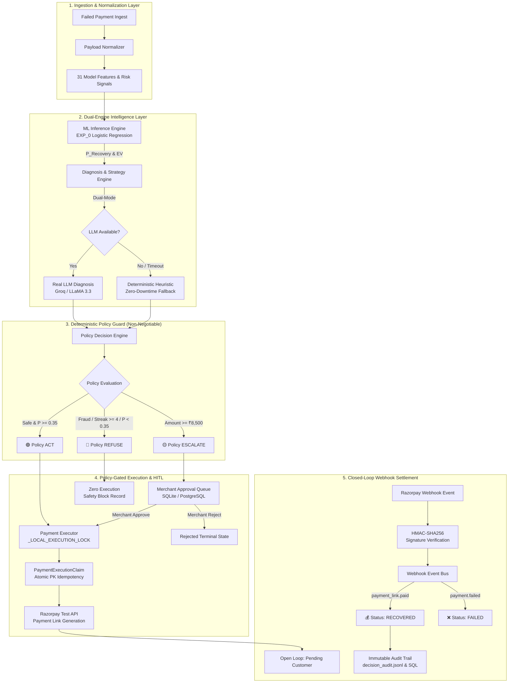

# RecoverAI — AI Revenue Recovery Agent

> **Submission for Razorpay AI Buildathon**  
> An autonomous, policy-gated AI revenue recovery agent combining calibrated ML recovery prediction, Expected Value (EV) decision optimization, structured LLM reasoning, deterministic financial safety guardrails, Human-in-the-Loop merchant governance, and cryptographically verified Razorpay webhook settlement.

---

[](https://www.python.org/)
[](https://fastapi.tiangolo.com/)
[](https://streamlit.io/)
[](https://github.com/langchain-ai/langgraph)
[](https://scikit-learn.org/)
[](https://razorpay.com/)
[-brightgreen.svg)]()

---

## 📌 Executive Summary

Failed payments in e-commerce, D2C, and subscription businesses cause severe revenue bleed and involuntary customer churn. Standard recovery mechanisms rely on **blind, crude cron retries** that burn payment gateway fees, harass customers, and repeatedly fail on non-recoverable errors.

**RecoverAI** solves this by introducing an intelligent, multi-stage recovery architecture governed by a strict fintech invariant:

$$\mathbf{\text{LLM Recommends} \quad\longrightarrow\quad \text{Deterministic Policy Controls} \quad\longrightarrow\quad \text{Human Approves Escalations} \quad\longrightarrow\quad \text{Webhooks Verify Settlement}}$$

1. **ML Recovery Propensity**: Predicts exact recovery probability $P(\text{recovery})$ using calibrated machine learning trained on historical transaction features.
2. **Expected Value Optimization**: Calculates Expected Recovery Value ($\text{EV} = P \times \text{Amount} - \text{Action Cost}$) to optimize decision thresholds ($\tau = 0.35$), unlocking **$+1.95\%$ in pure net profit uplift** ($+₹30,774.87$ on holdout data) over naive $0.50$ industry baselines.
3. **AI Diagnosis & Recommendation**: Uses LLMs with structured Pydantic schemas for root-cause failure diagnosis and strategy generation, backed by a zero-downtime deterministic heuristic fallback.
4. **Deterministic Financial Policy Guard**: Enforces non-negotiable financial rules (hard fraud blocks, streak limits, amount thresholds $\ge ₹8,500$) before any external action can execute. **The LLM has zero direct payment execution authority.**
5. **Human-in-the-Loop (HITL) Governance**: Automatically routes high-value ($> ₹8,500$) or boundary transactions into a dedicated Merchant Approval Queue with atomic thread locking and idempotency protection.
6. **Closed-Loop Razorpay Webhook Settlement**: Action execution is decoupled from settlement. Transactions are only marked `RECOVERED` upon receipt of cryptographically verified (`HMAC-SHA256`) Razorpay webhook events (`payment_link.paid`), completely eliminating phantom revenue.

---

## 🚨 The Problem

When a customer's payment fails at checkout, merchants face a difficult optimization dilemma:

* **Blind Retries Burn Fees**: Blindly retrying every failed transaction incurs unnecessary gateway charges and burns merchant margins.
* **Customer Churn & Friction**: Spamming customers with aggressive payment requests on invalid cards or bank outages creates poor brand perception.
* **High-Value Risk Exposure**: Allowing autonomous AI to execute high-value orders ($> ₹10,000$) without merchant oversight creates financial liability.
* **Fraud & Chargeback Vulnerabilities**: Blindly generating payment links for suspicious transactions with high IP velocity increases merchant dispute and chargeback rates.
* **Phantom Revenue Reporting**: Traditional systems count payment link generation as "recovered revenue" without verifying whether the customer actually paid.

### The Decision Dilemma
For every failed payment, a recovery engine must systematically decide:
1. **Should we attempt recovery?** (Is $P(\text{recovery})$ high enough to produce positive Expected Value?)
2. **What strategy should we use?** (Silent retry, smart payment link, or soft reminder?)
3. **Is it safe to execute autonomously?** (Are there fraud flags, streak limits, or permanent instrument errors?)
4. **Does a merchant human need to review?** (Does the transaction amount exceed safety thresholds?)

---

## 💡 The Solution

RecoverAI structures the revenue recovery lifecycle into an end-to-end, multi-stage pipeline:

```text
       FAILED PAYMENT EVENT (Gateway Timeout, Bank Decline, Card Drop)
                                │
                                ▼
                   1. CONTEXT NORMALIZATION
                   (31 Approved Model Features, Historical Risk Signals)
                                │
                                ▼
                   2. ML RECOVERY PREDICTION
                   (EXP_0 Calibrated Model -> P(Recovery), Expected Value)
                                │
                                ▼
                   3. AI FAILURE DIAGNOSIS
                   (LLM Pattern Diagnosis or Zero-Downtime Heuristic Fallback)
                                │
                                ▼
                   4. RECOVERY RECOMMENDATION
                   (Structured Action Recommendation: retry, payment_link, reminder)
                                │
                                ▼
                   5. DETERMINISTIC POLICY GUARD
                   (Immutable Business Rules: Fraud Block, Streak Limit, EV Threshold)
                                │
          ┌─────────────────────┼─────────────────────┐
          ▼                     ▼                     ▼
     🟢 ACT                🟡 ESCALATE           🔴 REFUSE
(Safe & EV-Positive)   (High-Value >= ₹8.5k) (Fraud / Negative EV)
          │                     │                     │
          ▼                     ▼                     ▼
6. ATOMIC EXECUTION    MERCHANT APPROVAL      ZERO EXECUTION
(Idempotency Claim)          QUEUE          (Spares Action Fees
(Razorpay Payment Link)    (HITL Review)    & Customer Spam)
          │                     │                     │
          ▼             ┌───────┴───────┐             │
     OPEN LOOP          ▼               ▼             │
(Status: PROCESSING)  APPROVE         REJECT          │
          │             │               │             │
          │             ▼               ▼             ▼
          │       (Atomic Exec)   (No Payment)    SAFETY AUDIT
          │             │               │          RECORDED
          ▼             ▼               │
    7. RAZORPAY WEBHOOK EVENT BUS       │
    (HMAC-SHA256 Signature Verified)    │
          │                             │
          ├─► payment_link.paid   ──────┼────────► 💰 REVENUE RECOVERED
          ├─► payment.failed      ──────┼────────► ❌ PAYMENT FAILED
          └─► payment_link.expired ─────┘
```

---

## 🏗️ System Architecture



---

## 🎯 Verified Financial Impact (Holdout Test Set $N = 633$)

Evaluated on the untouched 15% holdout test dataset ($N = 633$ failed payments, stratified split, `random_state=42`):

| Metric | Industry Baseline ($\tau = 0.50$) | RecoverAI EV-Optimal ($\tau = 0.35$) | Net Business Improvement ($\Delta$) |
| :--- | :---: | :---: | :---: |
| **Total Revenue at Risk** | ₹1,579,773.00 | ₹1,579,773.00 | Total evaluatable failed transaction volume |
| **Interventions Selected** | 485 transactions ($76.6\%$) | **521 transactions ($82.3\%$)** | $+36$ additional recoverable orders captured |
| **Gross Recovered Revenue** | ₹889,907.57 | **₹920,754.44** | **$+₹30,846.87$ gross revenue uplift** |
| **Action Costs Incurred** | ₹4,117.00 | **₹4,189.00** | $+₹72.00$ incremental action cost |
| **Realized Net Value** | ₹885,790.57 | **₹916,565.44** | **$+₹30,774.87$ net profit gain (+1.95%)** |
| **Gross Risk Capture Rate** | 56.3% | **58.3%** | **$+2.0\%$ absolute recovery capture** |
| **Model Calibration** | Logistic Regression | EXP_0 Calibrated Pipeline | Zero post-treatment data leakage |

### 🔬 Causal Treatment Effect Evaluation (`evaluation/causal_lift.py`)

To evaluate recovery intervention impact beyond raw observational correlation, RecoverAI incorporates a **Propensity Score Inverse Probability Weighting (IPW)** causal evaluation engine:
* **Propensity Score Model**: Logistic Regression estimating treatment assignment probability $P(\text{recovery\_attempted} \mid \mathbf{X})$ on pre-treatment covariates with weights clipped to $[0.01, 0.99]$.
* **IPW-Adjusted Average Treatment Effect (ATE)**: **+1.31 percentage points** (95% Bootstrap CI: **[-2.50%, +5.56%]** over 1,000 iterations, `seed=42`).
* **Statistical Significance Assessment**: The 95% bootstrap confidence interval includes zero ($[-2.50\%, +5.56\%]$); therefore, the treatment effect is not statistically distinguishable from zero in this offline synthetic-data benchmark.
* **Methodological Scope**: This evaluation represents an observational analysis on synthetic historical logs and is **NOT a randomized live A/B experiment**.

---

## 🧠 The Intelligence Layer

### 1. ML Recovery Prediction (`ml/predict.py`)
* **Model Pipeline**: Calibrated Logistic Regression pipeline with `StandardScaler` on numerical features and `OneHotEncoder(handle_unknown="ignore")` on categorical attributes.
* **Production Model Architecture**: Logistic Regression is the frozen production model used for deterministic agent inference and calibrated probability estimation, while alternative models (such as Random Forest and XGBoost) are evaluated separately during experimentation and benchmarking.
* **31 Approved Model Features**: Incorporates transaction amount, temporal features (`hour`, `day_of_week`, `is_weekend`), payment channels (`card`, `upi`, `netbanking`), failure categories, historical customer success rates, previous failure counts (24h/7d), IP risk scores, and velocity signals.
* **Strict Target Leakage Audit**: Enforces zero post-recovery or target variables (`payment_status`, `recovery_attempt_count`, `customer_contacted_today`) in model inference.
* **Expected Value Formulation**:
  $$\text{EV} = P(\text{recovery}) \times \text{Amount} - \text{Action Cost}$$

#### Model Artifacts and Runtime Usage
RecoverAI maintains two serialized model artifacts to separate live agent inference from baseline economic benchmarking:
* **Primary Production Runtime Model (`ml/models/recovery_model.joblib`)**:
  - **Architecture**: Calibrated Logistic Regression pipeline with `ColumnTransformer` (preprocessor + classifier).
  - **Feature Count**: **31 approved features** (amount, customer success rate, streaks, IP risk, velocity, channel, failure telemetry).
  - **Loaded By**: `ml/predict.py:load_recovery_model()` via `predict_recovery_probability()`.
  - **Runtime Role**: Primary inference model powering the LangGraph agent (`agent/nodes/prediction.py`), backend REST API endpoints (`/api/v1/recovery`, `/api/v1/demo`), and the interactive Streamlit Command Center (Tab 2 Simulator & Tab 3 Decision Trace).
* **Reference Baseline Model (`ml/models/experiments/exp_0_baseline.joblib`)**:
  - **Architecture**: Frozen 5-feature baseline Logistic Regression pipeline.
  - **Feature Count**: **5 basic features** (`amount`, `hour`, `day_of_week`, `payment_method`, `failure_reason`).
  - **Loaded By**: `agent/orchestrator.py` and `evaluation/business_metrics.py`.
  - **Runtime Role**: Serves as the frozen empirical reference baseline for offline Expected Value threshold optimization curves (`evaluation/business_metrics.py`), stress testing (`evaluation/sensitivity_analysis.py`), and the top-level macro KPI benchmark card in Streamlit (Tab 1).
* **Why Both Artifacts Exist**: Separating the reference benchmark from production inference ensures that offline economic comparisons (proving the $+₹30,774.87$ uplift over the industry naive 0.50 threshold) remain reproducible and uncoupled from production agent runtime feature expansions.

### 2. Dual-Mode AI Diagnosis & Recommendation (`agent/services/llm_service.py`)
* **Mode 1 (LLM Intelligence)**: When configured with `LLM_ENABLED=true` and a valid API key (Groq / OpenAI / LLaMA 3.3), prompts LLMs with strict Pydantic schemas (`RecoveryDiagnosis`, `RecoveryRecommendation`) to output root-cause failure analyses and structured recovery tactics.
* **Mode 2 (Zero-Downtime Deterministic Fallback)**: If the LLM provider experiences network latency, rate limits (HTTP 429), or malformed outputs, RecoverAI automatically degrades to deterministic heuristics without interrupting workflow execution.
* **Fintech Invariant**: The LLM recommends; it has **zero authority** to execute payments directly or bypass downstream policies.

### 3. Deterministic Policy Guard (`agent/nodes/policy.py`)
The Policy Guard enforces immutable financial guardrails through 3 discrete outcomes:

```text
1. 🟢 ACT      - Safe, low-risk, EV-positive transaction (P >= 0.35, amount < ₹8,500, IP risk <= 0.70).
2. 🟡 ESCALATE - Autonomous execution halted; requires merchant review (amount >= ₹8,500 or uncertainty band 0.32 <= P <= 0.38).
3. 🔴 REFUSE   - Deliberately refuses recovery action (fraud/risk failure, IP risk > 0.70, permanent card failure, streak >= 4, or P < 0.35).
```

> **🛡️ Critical Safety Invariant**: Fraud blocks (`ip_risk_score > 0.70` or `failure_reason == "suspected_risk"`) are permanent and mathematically cannot be overridden by human approval via the UI or REST API.

### 4. Deterministic Decision Explanation Layer (`agent/nodes/policy.py`)
RecoverAI exposes a fully structured, deterministic explanation of why the policy engine reached its final decision (`ACT`, `ESCALATE`, or `REFUSE`). Explanations are derived 100% deterministically from evaluated criteria and frozen thresholds:
* **Structured Explanation Schema**:
  ```json
  {
    "decision": "ACT",
    "summary": "Calibrated recovery probability exceeds operational threshold (τ = 0.35)...",
    "primary_factor": "STANDARD_POLICY_APPROVAL",
    "reasons": [
      "Predicted recovery probability (98.5%) meets or exceeds operational threshold (τ = 0.35).",
      "Failure categorized as transient (transient) with no permanent instrument defect.",
      "Consecutive failure streak (0) is within safe retry limit (< 4).",
      "Transaction amount (₹2,500.00) is within autonomous execution boundary (< ₹8,500.00).",
      "Zero safety policy violations detected."
    ],
    "policy_checks": {
      "fraud_risk": "PASSED",
      "instrument_status": "PASSED",
      "failure_streak": "PASSED",
      "recovery_viability": "PASSED",
      "value_threshold": "PASSED",
      "confidence_band": "PASSED",
      "velocity_risk": "PASSED"
    },
    "metrics_evaluated": {
      "recovery_probability": 0.9855,
      "operational_threshold_tau": 0.35,
      "transaction_amount": 2500.0,
      "high_value_limit": 8500.0,
      "consecutive_failure_streak": 0,
      "streak_limit": 4,
      "ip_risk_score": 0.05,
      "ip_risk_limit": 0.70
    }
  }
  ```
* **Audit Trail Traceability**: Persisted automatically into the `AuditLog.details` JSON column with zero database schema migrations.

### 5. Defensive PII Redaction Layer (`agent/services/pii_redaction.py`)
To prevent sensitive customer identifiers from leaking to third-party model providers (OpenAI / Groq), RecoverAI enforces a deep-copy prompt-boundary sanitization layer:
* **Perimeter Sanitization**: Deep-copies context immediately before JSON prompt serialization (`user_prompt = f"...\n{json.dumps(safe_context)}"`); the original `AgentState` and transaction data remain 100% immutable and unmutated.
* **Direct Key Scrubbing**: Replaces exact personal identity keys (`customer_email`, `email`, `customer_name`, `full_name`, `phone_number`, `mobile_number`, `address`) with redaction markers.
* **Unstructured Text Redaction**: Recursively scans free-form strings (e.g. gateway error messages in `failure_reason`) to redact email addresses (`[REDACTED_EMAIL]`), Indian/international phone numbers (`[REDACTED_PHONE]`), and 13–19 digit card PANs (`[REDACTED_CARD]`).
* **Operational Telemetry Preservation**: Whitelists and guarantees untouched preservation of business fields (`transaction_id`, `customer_id`, `amount`, `currency`, `payment_method`, probabilities, and risk scores).

### 6. Interactive Agent Decision Timeline (`frontend/app.py`)
The Streamlit Command Center (Tabs 2 & 3) visually renders the complete 7-stage lifecycle of every recovery decision:
1. **Context Loaded**: Ingestion of transaction amounts, payment methods, and historical risk features.
2. **ML Recovery Prediction**: Calibrated probability estimation ($P$) and Expected Recovery Value ($\text{EV}$).
3. **Failure Diagnosis**: Root-cause categorization with LLM/Heuristic provenance badges.
4. **AI Strategy Recommendation**: Proposed action tactic with observable contributing factors.
5. **Deterministic Policy Guard**: Verdict badge (`ACT`, `ESCALATE`, `REFUSE`) with an interactive, expandable breakdown of the 7 policy checks and evaluated criteria.
6. **Controlled Execution**: Action dispatch or fee-sparing block confirmation.
7. **Audit Logging & State Persistence**: Verification of atomic database recording in `AuditLog`.

---

## 👤 Human-in-the-Loop (HITL) Governance

For high-value transactions or boundary edge cases, autonomous AI execution creates unacceptable liability. RecoverAI implements a comprehensive HITL review workflow:

```text
HIGH-VALUE / UNCERTAIN PAYMENT (e.g. ₹14,500 >= ₹8,500 threshold)
                            │
                            ▼
                  POLICY VERDICT: ESCALATE
                            │
                            ▼
              AUTO-INSERTED INTO APPROVAL QUEUE
              (Table: ApprovalRequest | Status: PENDING_APPROVAL)
                            │
                            ▼
                 MERCHANT REVIEWS IN DASHBOARD
                 (Inspects ML Prob, EV, & AI Rationale)
                            │
               ┌────────────┴────────────┐
               ▼                         ▼
        ✓ APPROVE RECOVERY        ✗ REJECT RECOVERY
               │                         │
               ▼                         ▼
      _APPROVAL_LOCK Mutex       Marked: REJECTED_BY_MERCHANT
      Idempotency PK Claim       Zero payment actions executed
      Razorpay Link Created      Terminal State (State Machine Locked)
               │                         │
               ▼                         ▼
    Status: APPROVED_BY_HUMAN    Immutable Audit Log Recorded
```

* **Atomic Mutex & Thread Locking**: `_APPROVAL_LOCK` in `database/repository.py` and `_LOCAL_EXECUTION_LOCK` in `payment/executor.py` prevent double-approval race conditions under concurrent admin clicks.
* **State Machine Protection**: Once approved or rejected, transactions enter locked terminal states; secondary approval attempts return HTTP 409 Conflict.

---

## 🔄 Closed-Loop Webhook Recovery Architecture

RecoverAI eliminates phantom revenue by decoupling recovery initiation from settlement confirmation:

```text
┌─────────────────────────┐
│     Failed Payment      │
└────────────┬────────────┘
             │
             ▼
┌─────────────────────────┐
│ LangGraph Agent Policy  │──[REFUSE/ESCALATE]──► Zero External Calls
└────────────┬────────────┘
             │ [ACT]
             ▼
┌─────────────────────────┐
│ Razorpay Link Created   │──► Claim Status: SUCCEEDED (Open Loop)
└────────────┬────────────┘
             │
             ▼ (Customer pays / fails / link expires asynchronously)
┌─────────────────────────┐
│ POST /api/v1/webhooks/  │
│        razorpay         │
└────────────┬────────────┘
             │
             ├─► 1. Raw Body Cryptographic Verification (HMAC-SHA256)
             ├─► 2. Event Normalization (payment_link_id, payment_id, reference_id)
             ├─► 3. Deterministic Claim Correlation (Primary: link ID, Fallback: ref ID)
             ├─► 4. Database Idempotency Check (prevents double financial credit)
             ▼
┌─────────────────────────┐
│ Closed-Loop Settlement  │
└────────────┬────────────┘
             ├─► payment_link.paid    ──► Claim: PAID | Payment: RECOVERED | Action: SETTLED
             ├─► payment.failed       ──► Claim: PAYMENT_FAILED | Payment: FAILED (Never RECOVERED)
             ├─► payment_link.expired ──► Claim: EXPIRED | Payment: FAILED (Never RECOVERED)
             ▼
┌─────────────────────────┐
│   Immutable Audit Log   │──► AuditLog (event_type=WEBHOOK_OUTCOME, actor=RAZORPAY_WEBHOOK)
└─────────────────────────┘
```

* **Cryptographic Verification**: Verifies incoming signatures using `hmac.new(secret, raw_body, hashlib.sha256).hexdigest()`.
* **Idempotent Webhook Delivery**: Duplicate deliveries of `payment_link.paid` are safely acknowledged without corrupting financial ledgers.

---

## 🎮 The Four Canonical Buildathon Demo Scenarios

| Scenario | Name | Real Context & Signals | Expected Policy | Actual Agent Decision | Actual ML Probability | Final Verified Outcome |
| :--- | :--- | :--- | :---: | :---: | :---: | :--- |
| **🟢 Scenario A** | **Smart Auto-Recovery** | Transient network timeout, ₹2,500, High Tier (95% hist. success), IP Risk 0.04 | **`ACT`** | **`ACT`** | **98.9%** | Auto-executed $\to$ Webhook settled $\to$ `💰 RECOVERED` |
| **🟡 Scenario B** | **High-Value HITL Approval** | Transient timeout, ₹14,500 ($> ₹8,500$ limit), High Tier, IP Risk 0.05 | **`ESCALATE`** | **`ESCALATE`** | **76.7%** | Enters Approval Queue $\to$ Merchant Approves $\to$ Executed |
| **🔴 Scenario C** | **Fraud / Risk Block** | Suspected risk, ₹7,500, IP Risk 0.92, Velocity 0.85 | **`REFUSE`** | **`REFUSE`** | **N/A** (Hard Safety) | Blocked $\to$ 0 money moved $\to$ Prohibited from HITL Queue |
| **⚪ Scenario D** | **Negative EV Avoidance** | Bank decline, ₹3,200, Netbanking Axis, 0% hist. success, Velocity 0.85 | **`REFUSE`** | **`REFUSE`** | **5.1%** ($P < 0.35$) | Rational Refusal $\to$ Spares action fee & customer spam |

---

## 🖥️ Product Dashboard (Streamlit Command Center)

The Streamlit dashboard (`frontend/app.py`) provides an interactive operations workbench across 5 dedicated workspaces:

1. **🏠 Recovery Command Center**: 5 Hero KPI cards (Revenue at Risk, Revenue Recovered, Net Profit Uplift, Recovery Rate, Pending Reviews), EV economic comparison, 5-stage visual funnel, AI decision distribution cards, and real-time persisted database activity stream.
2. **🎮 Demo Simulator**: 1-click Buildathon scenario selector cards (A, B, C, D), custom amount input with boundary testing, closed-loop settlement toggle, real-time Expected vs. Actual comparison card, business impact interpretation box, and "🔄 Reset / Replay" button.
3. **🤖 Live Agent Decision Trace**: 7-stage visual pipeline, visible LLM vs Heuristic engine badges, zero Chain-of-Thought leakage in details drawers, and live Razorpay webhook simulator button.
4. **👤 Merchant Approval Queue**: High-value review queue with financial safety banner (*"Fraud blocks cannot be overridden"*), transaction attribute inspection, and atomic `✓ APPROVE` / `✗ REJECT` buttons.
5. **📊 Recovery Insights & Governance**: Policy threshold comparison table, Population Stability Index (PSI) feature drift monitor, and immutable JSON-lines audit trail viewer.

---

## 🛠️ Technology Stack

| Layer | Technology | Purpose & Implementation in RecoverAI |
| :--- | :--- | :--- |
| **Runtime & Language** | **Python 3.10+** | Core runtime for backend API, agent graph, ML pipelines, and Streamlit frontend |
| **Agentic Workflow** | **LangGraph (`StateGraph`)** | Stateful multi-node workflow orchestration with conditional routing |
| **Machine Learning** | **scikit-learn** | Calibrated Logistic Regression pipeline, `ColumnTransformer`, `StandardScaler` |
| **Data Processing** | **Pandas & NumPy** | Feature engineering, quantile binning, matrix calculations, and evaluation splits |
| **API Backend** | **FastAPI & Pydantic** | REST API endpoints (`/api/v1/recovery`, `/api/v1/approvals`, `/api/v1/demo`, `/api/v1/webhooks`) |
| **Frontend UI** | **Streamlit** | Multi-tab interactive enterprise operations dashboard |
| **Database & ORM** | **SQLAlchemy & SQLite / PostgreSQL** | Persistent models (`FailedPayment`, `ApprovalRequest`, `AuditLog`, `PaymentExecutionClaim`) |
| **Payment Integration** | **Razorpay SDK & Webhooks** | Test Mode Payment Link generation and cryptographically verified HMAC webhook bus |
| **Governance & Drift** | **Population Stability Index (PSI)** | Statistical feature drift monitor comparing baseline distributions to incoming streams |
| **Automated Testing** | **Pytest & TestClient** | 157 automated regression tests across 21 test files with 100% pass rate |

---

## 📂 Project Structure

```text
RecoverAI — AI Revenue Recovery Agent/
├── agent/                      # LangGraph agent graph, orchestrator, and nodes
│   ├── nodes/                  # Policy, prediction, diagnosis, recommendation, context nodes
│   │   ├── context.py          # Node 1: Context loading & historical feature assembly
│   │   ├── prediction.py       # Node 2: ML inference & EV calculation
│   │   ├── diagnosis.py        # Node 3: AI failure diagnosis (LLM / Heuristic)
│   │   ├── recommendation.py   # Node 4: Recovery action recommendation
│   │   ├── policy.py           # Node 5: Deterministic Policy Guard (ACT / ESCALATE / REFUSE)
│   │   └── verification.py     # Node 7: Settlement & audit logging
│   ├── tools/
│   │   └── mock_actions.py     # Node 6: Policy-gated action execution
│   ├── services/
│   │   ├── llm_service.py      # Structured LLM service with fallback engine
│   │   └── pii_redaction.py    # Defensive PII sanitization (emails, phones, cards)
│   ├── graph.py                # LangGraph StateGraph assembly & conditional routing
│   └── demo_data.py            # Normalized demo transaction builder
├── backend/                    # FastAPI application & REST endpoints
│   ├── routes/                 # Recovery, approvals, demo, and webhook routers
│   ├── schemas/                # Pydantic schemas for request/response contracts
│   └── main.py                 # FastAPI application factory & middleware
├── database/                   # Database persistence layer
│   ├── models.py               # SQLAlchemy models (FailedPayment, ApprovalRequest, AuditLog, etc.)
│   ├── repository.py           # Thread-safe CRUD operations, mutexes, and state transitions
│   └── database.py             # Engine creation and session management
├── evaluation/                 # Business evaluation & causal lift
│   ├── business_metrics.py     # Expected Value grid optimization & threshold selection
│   ├── causal_lift.py          # Propensity score IPW causal treatment evaluation
│   └── sensitivity_analysis.py # 6-scenario financial stress testing
├── frontend/
│   └── app.py                  # Polished Streamlit Command Center (Tabs 1-5, Decision Timeline)
├── ml/                         # Machine learning pipeline
│   ├── features.py             # 31 approved model features & target leakage audit
│   ├── predict.py              # ML inference engine & model loader
│   ├── train.py                # Pipeline training & artifact serialization
│   └── models/                 # Pretrained joblib model artifacts
├── monitoring/
│   └── drift_detection.py      # Population Stability Index (PSI) feature drift engine
├── payment/                    # Payment gateway integrations
│   ├── executor.py             # Idempotency claim gating & thread locking
│   ├── razorpay_client.py      # Razorpay SDK client wrapper
│   └── webhook.py              # HMAC-SHA256 signature verification & event normalizer
├── tests/                      # Automated test suite (157 test cases across 21 test files)
├── README.md                   # Comprehensive system documentation
└── requirements.txt            # Project dependencies
```

---

## ⚡ How to Run Locally

### 1. Environment Setup
```bash
# 1. Clone repository
git clone https://github.com/Aashi0105/RecoverAI.git
cd "RecoverAI — AI Revenue Recovery Agent"

# 2. Create and activate virtual environment
# Windows PowerShell:
python -m venv venv
.\venv\Scripts\Activate.ps1

# macOS / Linux:
python3 -m venv venv
source venv/bin/activate

# 3. Install dependencies
pip install -r requirements.txt

# 4. Configure environment variables
cp .env.example .env
```

### 2. Launch Streamlit Dashboard
```bash
streamlit run frontend/app.py
# Access dashboard at http://localhost:8501
```

### 3. Launch FastAPI Backend Server (Optional)
```bash
uvicorn backend.main:app --reload --port 8000
# Access Swagger API documentation at http://localhost:8000/docs
```

### 4. Run Automated Test Suite
```bash
pytest tests/ -v
# Verified: 157 passed in ~2.5 minutes (100% pass rate)
```

---

## 🛡️ Production Postmortems: "What Broke at 2 AM & How We Fixed It"

| Postmortem / Failure Mode | Root Cause Discovered | How We Fixed It (Architectural Solution) |
| :--- | :--- | :--- |
| **1. Phantom Revenue Bleed** | Payment links were generated and recorded as "revenue recovered" before customers actually paid. | Decoupled link generation from settlement via **cryptographic Razorpay Webhook verification** (`payment_link.paid`). Status only transitions to `RECOVERED` upon webhook confirmation. |
| **2. LLM Hallucination Risk** | LLMs recommended invalid actions (e.g. attempting card retries without saved tokens or on expired cards). | Implemented downstream **Deterministic Policy Guard**. The LLM recommendations are constrained to an allowed-action set, and the deterministic policy retains absolute final veto authority. |
| **3. 15ms Double-Charge Race Condition** | Concurrent webhooks or double-clicks triggered multiple payment links for the same failed transaction. | Added **Database Primary Key Claims** (`PaymentExecutionClaim`) combined with in-process thread locking (`_LOCAL_EXECUTION_LOCK`). Subsequent requests receive cached results with 0 duplicate API calls. |
| **4. LLM Provider Rate Limits (429)** | External LLM provider timeouts or HTTP 500 errors halted automated recovery workflows. | Built a **Zero-Downtime Deterministic Heuristic Engine** (`agent/services/llm_service.py`) that instantly handles failure diagnosis and recovery recommendations without crashing. |
| **5. Sub-Optimal 50% Threshold Bleed** | Industry standard $\tau = 0.50$ cutoff missed high-margin recoverable transactions. | Conducted offline Expected Value threshold optimization, proving $\tau = 0.35$ captures **$+₹30,774.87$ in incremental net revenue** while factoring in action costs. |

---

## 🎬 3-Minute Buildathon Demo Flow

```text
⏱️ MINUTE 1: THE REVENUE OPPORTUNITY
1. Open Streamlit Dashboard (Tab 1: 🏠 Recovery Command Center).
2. Point out Total Revenue at Risk (₹1.58M) and explain the EV Performance Story (τ = 0.35 captures +₹30,774 net profit uplift over default 0.50).
3. Review the 5-stage Recovery Funnel and active real-time transaction activity stream.

⏱️ MINUTE 2: AUTONOMOUS RECOVERY & CLOSED-LOOP SETTLEMENT
1. Switch to Tab 2 (🎮 Demo Simulator) -> Select Scenario A (Smart Auto-Recovery, ₹2,500).
2. Click "🚨 SIMULATE PAYMENT FAILURE & RUN AGENT".
3. Switch to Tab 3 (🤖 Live Agent Decision Trace) -> Walk through the 7-stage visual pipeline:
   - ML predicts 98.9% recovery probability.
   - LLM diagnoses transient timeout.
   - Policy Guard issues verdict: ACT.
   - Razorpay Payment Link generated safely.
4. Click "💳 Simulate Customer Paid Webhook Event" -> Observe transaction atomically settle to 💰 RECOVERED.

⏱️ MINUTE 3: HUMAN-IN-THE-LOOP & FRAUD PROTECTION
1. Return to Tab 2 -> Select Scenario B (High-Value Human Approval, ₹14,500).
2. Run simulation -> Policy detects amount > ₹8,500 threshold and halts autonomous execution (ESCALATE).
3. Switch to Tab 4 (👤 Merchant Approval Queue) -> Review AI rationale and click "✓ APPROVE RECOVERY" (executes strictly once).
4. Return to Tab 2 -> Select Scenario C (Fraud / Risk Block, IP risk 0.92).
5. Run simulation -> Deterministic Policy Guard enforces hard REFUSE (0 money moved, prohibited from human override).
```

---

## 📜 License & Acknowledgements

* Built for the **Razorpay AI Buildathon**.
* Powered by **Razorpay Python SDK**, **LangGraph**, **FastAPI**, **scikit-learn**, and **Streamlit**.
* Developed with strict compliance to financial auditability and data governance principles.
