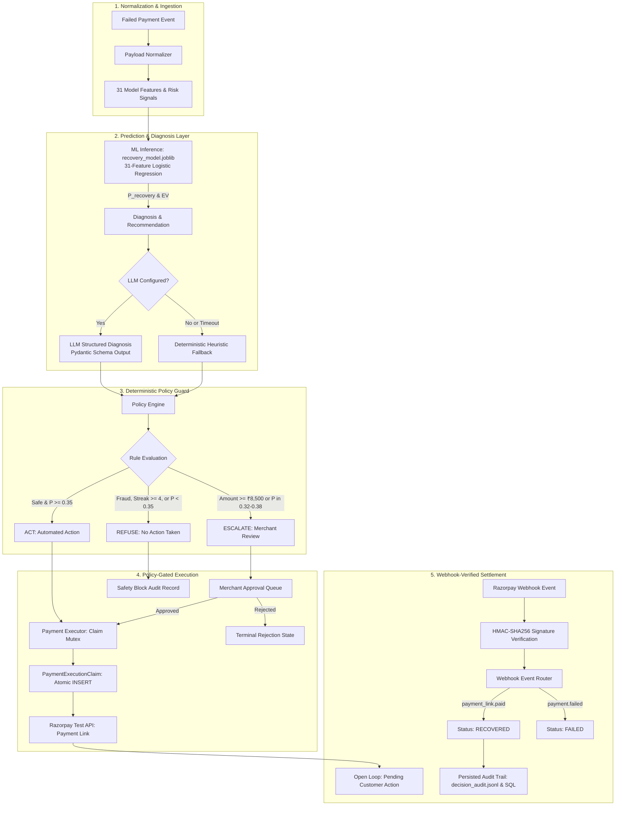

# RecoverAI — AI Revenue Recovery Agent

Failed payments cost online merchants revenue, but blindly retrying every failure wastes gateway fees and customer goodwill. RecoverAI predicts recovery probability for each failed payment and intervenes only when expected recovery exceeds action cost. The language model diagnoses failure patterns, but hard deterministic policy rules govern whether any payment action is actually executed.

---

[](https://www.python.org/)
[](https://fastapi.tiangolo.com/)
[](https://streamlit.io/)
[](https://github.com/langchain-ai/langgraph)
[](https://scikit-learn.org/)
[](https://razorpay.com/)
[-brightgreen.svg)]()

---

## The Problem

When a payment fails during checkout or subscription renewal, merchants usually fall back on two crude approaches: blind retries or manual review. Retrying every failed card burns gateway fees on permanent errors like expired cards, quickly exhausts bank retry limits, and irritates customers. Manual follow-up is too slow, so dropped checkouts quietly turn into permanent customer churn.

Existing recovery tools often introduce problems of their own. Unchecked automation can trigger unauthorized retries on large orders. Blindly resubmitting transactions flagged for high velocity or suspicious IPs drives up chargeback rates. And systems that count payment-link creation as "recovered revenue" report phantom income before any money has actually cleared.

RecoverAI treats recovery as an optimization problem. The system estimates the probability of recovery for a specific failure, checks whether an intervention produces positive expected value after action costs, evaluates hard safety rules, and marks revenue recovered only after a verified webhook confirms settlement.

---

## How RecoverAI Works



---

## Design Principles

The system architecture follows a clear separation of responsibility:

```text
ML predicts → LLM recommends → Deterministic policy decides → Human reviews escalations → Webhooks confirm settlement
```

A calibrated machine learning classifier estimates recovery probability from historical transaction features. Next, a language model analyzes failure telemetry to diagnose the root cause and propose recovery tactics, operating strictly as an advisor with no payment API credentials. A deterministic policy engine then evaluates non-overridable business rules. If a safety rule fails, execution halts immediately regardless of what the language model recommended.

Transactions involving high values (>= ₹8,500) or borderline model confidence pause in a merchant approval queue for human review. Finally, no transaction is treated as recovered simply because a payment link was generated. The loop closes only when a cryptographically verified Razorpay webhook confirms payment settlement.

---

## Verified Offline Evaluation

Evaluated on the 15% holdout test dataset (N = 633 failed payments, stratified split, `random_state=42`):

| Metric | Reference Threshold (τ = 0.50) | RecoverAI EV-Optimal (τ = 0.35) | Net Business Improvement (Δ) |
| :--- | :---: | :---: | :---: |
| **Total Revenue at Risk** | ₹1,579,773.01 | ₹1,579,773.01 | Total evaluatable failed transaction volume |
| **Interventions Selected** | 485 transactions (76.6%) | **521 transactions (82.3%)** | +36 additional recoverable orders captured |
| **Gross Recovered Revenue** | ₹889,907.57 | **₹920,754.44** | **+₹30,846.87 gross revenue uplift** |
| **Action Costs Incurred** | ₹4,117.00 | **₹4,189.00** | +₹72.00 incremental action cost |
| **Realized Net Recovery Value** | ₹885,790.57 | **₹916,565.44** | **+₹30,774.87 net value uplift (+1.95%)** |
| **Gross Risk Capture Rate** | 56.3% | **58.3%** | +2.0% absolute recovery capture |
| **Model Calibration** | Logistic Regression | EXP_0 Baseline Pipeline | Evaluated on holdout data |

> Evaluation Methodology Note: These figures are generated from offline holdout evaluation and Expected Value analysis on synthetic transaction logs (`data/raw/transactions.csv`). They represent modeled recovery outcomes based on simulated interventions and historical conversion distributions, not live merchant revenue results.

---

## Core Capabilities

### ML Prediction & Expected Value Optimization

The recovery decision uses an Expected Value (EV) calculation:

$$\text{EV} = P(\text{recovery}) \times \text{Amount} - \text{Action Cost}$$

Action costs reflect communication and gateway fees: ₹5 for a payment link, ₹2 for a reminder, and ₹0 when no action is taken. Sweeping candidate thresholds across the development split identified τ = 0.35 as the point maximizing net recovery value. It captures borderline transactions where the order size comfortably offsets the small intervention cost.

#### Model Architecture and Artifact Roles

Two serialized scikit-learn pipelines serve distinct roles in the codebase:

Production runtime model (`ml/models/recovery_model.joblib`)
Trained on 31 approved features spanning transaction amount, customer success rates, failure streaks, IP risk, velocity scores, and failure category codes. The pipeline applies standard scaling to numeric fields and one-hot encoding to categoricals before passing them to a calibrated Logistic Regression. This artifact powers live agent execution in LangGraph (`agent/nodes/prediction.py`), the backend REST API (`/api/v1/recovery`), and the interactive Streamlit simulator.

Reference baseline model (`ml/models/experiments/exp_0_baseline.joblib`)
A simpler 5-feature baseline using amount, hour, day of week, payment method, and failure reason. This model serves as the fixed benchmark for offline Expected Value threshold curves (`evaluation/business_metrics.py`), sensitivity stress testing, and the comparison cards in the dashboard.

### Dual-Mode Diagnosis & Fallback

The diagnosis layer supports two execution paths depending on environment configuration.

When an API key is present (`OPENAI_API_KEY` or `GROQ_API_KEY`), sanitized context goes to the language model with strict Pydantic validation schemas (`RecoveryDiagnosis` and `RecoveryRecommendation`). The model outputs failure categorizations and recommended recovery tactics.

If API credentials are unset, or if requests fail due to timeouts or HTTP 429 rate limits, the system falls back immediately to deterministic rule-based heuristics. In either case, the language model has no tool-calling access to payment gateways; its output serves purely as structured advisory input to the policy layer.

### Deterministic Policy Guard

Before any payment action can proceed, the policy guard in `agent/nodes/policy.py` checks the transaction against three outcomes:

Refusal (REFUSE)
Blocks recovery immediately if the failure indicates fraud (`failure_category == "risk_related"`, `failure_reason == "suspected_risk"`, or `ip_risk_score > 0.70`), permanent instrument failure (`invalid_card` or `card_expired`), excessive consecutive failures (`consecutive_failure_streak >= 4`), or sub-threshold probability (P(recovery) < 0.35). Hard fraud blocks cannot be overridden.

Escalation (ESCALATE)
Halts automated processing and queues the transaction for merchant review when the order amount is high (amount >= ₹8,500), when model probability falls within the uncertainty band (0.32 <= P(recovery) <= 0.38), or when velocity and IP risk trigger a combined warning (`velocity_score > 0.65` and `ip_risk_score > 0.50`).

Approval (ACT)
Authorizes recovery action dispatch only when all refusal and escalation checks pass.

### Human-in-the-Loop Review

Transactions flagged with an ESCALATE decision are written to the `approval_requests` database table with status `PENDING_APPROVAL`.

Merchants can inspect pending items in the dashboard, reviewing the estimated recovery probability, diagnosis notes, and specific triggered policy conditions. Approvals use thread locking alongside database state verification; if two operators resolve the same transaction concurrently, the first resolution locks the record, while the second request receives an HTTP 409 Conflict. When an operator rejects a transaction, it enters `REJECTED_BY_MERCHANT` as a terminal state with zero payment calls.

### Razorpay Settlement Verification

RecoverAI separates recovery dispatch from settlement confirmation.

When an ACT decision is cleared, the execution service creates a payment link via Razorpay's Test API and records an atomic database claim in `PROCESSING` state. Later, when the customer completes payment, Razorpay dispatches a `payment_link.paid` webhook event to `/api/v1/webhooks/razorpay`.

The webhook handler computes the HMAC-SHA256 digest of the raw request payload using the configured secret and compares it to the `X-Razorpay-Signature` header, rejecting mismatches with HTTP 400. Only when signature verification succeeds does the transaction status transition to `RECOVERED`. This accounting boundary prevents links that are sent but never paid from inflating recovery metrics.

### Defensive PII Redaction

Before any context dictionary is serialized into an LLM prompt (`agent/services/pii_redaction.py`), the redaction service creates an isolated deep copy so the application state remains unmodified. Direct identity keys like customer names, emails, phone numbers, and addresses are scrubbed. Free-form text fields (such as gateway error messages) are scanned with regular expressions to mask email addresses (`[REDACTED_EMAIL]`), phone numbers (`[REDACTED_PHONE]`), and card PANs (`[REDACTED_CARD]`), while preserving operational telemetry needed for diagnosis.

---

## Demo Scenarios

The repository includes four pre-configured scenarios (`backend/routes/demo.py`) demonstrating policy boundary behaviors:

| Scenario | Name | Context & Signals | Expected Policy | Outcome |
| :--- | :--- | :--- | :---: | :--- |
| **Scenario A** | Smart Auto-Recovery | Network timeout, ₹2,500, high historical success rate, IP risk 0.04 | `ACT` | Payment link created; settles to `RECOVERED` on webhook |
| **Scenario B** | High-Value Approval | Network timeout, ₹14,500 (>= ₹8,500 limit), IP risk 0.05 | `ESCALATE` | Enters merchant approval queue; requires human confirmation |
| **Scenario C** | Fraud Block | Suspected risk, ₹7,500, IP risk 0.92, velocity 0.85 | `REFUSE` | Hard block; no payment link; prohibited from approval queue |
| **Scenario D** | Low Probability Refusal | Bank decline, ₹3,200, Netbanking Axis, 0% historical success, velocity 0.85 | `REFUSE` | Blocked (P < 0.35); avoids spending action fee on unrecoverable payment |

---

## Integration Scope

| Component | Implementation Status | Scope & Environment |
| :--- | :--- | :--- |
| **Razorpay Payment Links** | Implemented | Real API calls using official Razorpay Python SDK in Test Mode |
| **Razorpay API Credentials** | Implemented | Requires `rzp_test_` key; live production keys (`rzp_live_`) are rejected by code validation |
| **Webhook Verification** | Implemented | Real HMAC-SHA256 signature verification on raw request body |
| **Webhook Delivery** | Dual-Mode | Supports live Razorpay webhooks and simulated local webhook injection for demos |
| **LLM Provider** | Dual-Mode | Real API integration with OpenAI / Groq; deterministic heuristic fallback if unconfigured |
| **Database Persistence** | Implemented | SQLAlchemy with SQLite default; compatible with PostgreSQL |
| **ML Training Data** | Synthetic | 20,000 synthetic transaction records calibrated to Indian fintech payment failure distributions |
| **Production Money Movement** | Not in Scope | Operates strictly in Test Mode / sandbox environments; no real customer funds are moved |

---

## Design Decisions & Trade-offs

1. Payment links are never counted as recovered revenue. Early in development, generating a link was treated as a recovery event, but that produced phantom revenue whenever customers ignored the link. Decoupling action execution from settlement confirmation—requiring a signed `payment_link.paid` webhook to mark an order recovered—resolved this discrepancy.

2. Language models should diagnose, not execute. Letting an LLM trigger payment APIs directly is fragile during outages or boundary errors. We restricted the model to emitting structured diagnosis schemas, placing all dispatch authority behind a deterministic policy guard.

3. Idempotency combines thread locks with database constraints. Duplicate webhook deliveries and rapid operator double-clicks can race within milliseconds. An in-memory thread lock catches duplicate requests inside the same process, while a unique constraint on `idempotency_key` in the `payment_execution_claims` table ensures safety across processes. Duplicate attempts simply return the existing claim.

4. LLM failures fall back silently to heuristics. Third-party model endpoints inevitably hit rate limits (HTTP 429) or transient timeouts. Rather than blocking the recovery pipeline, the diagnosis node falls back to deterministic rules that assign recovery strategies without disruption.

5. Threshold tuning beats a default 0.50 probability cutoff. In payment recovery, the cost of an automated intervention (like a ₹5 payment link) is far smaller than the recovered order value. Sweeping candidate thresholds on development data showed that lowering τ to 0.35 captured ₹30,846.87 in additional recovered revenue at an incremental action cost of just ₹72.00.

---

## Additional Evaluation

### Causal Treatment Effect Analysis (IPW)

To evaluate whether intervention lift is genuinely causal rather than purely observational, RecoverAI includes a Propensity Score Inverse Probability Weighting (IPW) analysis (`evaluation/causal_lift.py`):

Propensity score model: Logistic regression estimating intervention probability P(treated | X) across pre-treatment covariates, with weights clipped to [0.01, 0.99].

Treatment effect estimate: The IPW-adjusted Average Treatment Effect (ATE) is +1.31 percentage points, with a 95% bootstrap confidence interval of [-2.50%, +5.56%] over 1,000 iterations (`seed=42`).

Methodological scope: Because the 95% bootstrap confidence interval spans zero, the treatment effect is not statistically distinguishable from zero in this offline benchmark. This analysis was conducted on synthetic historical logs and does not substitute for a live randomized A/B trial.

### Sensitivity & Stress Testing

The threshold policy was evaluated across 6 stress scenarios (`evaluation/sensitivity_analysis.py`) varying failure reason distributions, action costs, and payment method mixes. Across all scenarios, the EV-optimized policy maintained positive net recovery value relative to the zero-intervention baseline.

---

## Technology Stack

- Runtime: Python 3.10+
- Workflow Orchestration: LangGraph (`StateGraph`)
- Machine Learning: scikit-learn (`Pipeline`, `ColumnTransformer`, `LogisticRegression`)
- API Backend: FastAPI, Pydantic v2, Uvicorn
- Database & Persistence: SQLAlchemy (SQLite default, PostgreSQL compatible)
- Payment Integration: Razorpay Python SDK, HMAC-SHA256 webhook verification
- Dashboard: Streamlit
- Testing: Pytest, FastAPI TestClient

---

## Project Structure

```text
RecoverAI/
├── agent/            # LangGraph workflow, policy engine, and decision nodes
│   ├── nodes/        # Prediction, diagnosis, policy guard, and verification nodes
│   ├── services/     # LLM service and PII redaction layer
│   └── graph.py      # Compiled StateGraph assembly and routing
├── backend/          # FastAPI REST API application and route handlers
│   └── routes/       # Recovery, approvals, demo, and webhook endpoints
├── database/         # SQLAlchemy models, repositories, and session management
├── evaluation/       # Expected Value optimization, causal lift, and stress tests
├── frontend/         # Streamlit Command Center dashboard
├── ml/               # Model training, feature pipelines, and serialized artifacts
│   └── models/       # recovery_model.joblib and exp_0_baseline.joblib
├── monitoring/       # Population Stability Index (PSI) feature drift detection
├── payment/          # Razorpay client wrapper, execution engine, and webhooks
├── policies/         # Frozen operational policy configuration
└── tests/            # Automated test suite (158 passing tests)
```

---

## Running Locally

### 1. Environment Setup
```bash
# Clone repository
git clone https://github.com/Aashi0105/RecoverAI.git
cd "RecoverAI — AI Revenue Recovery Agent"

# Create and activate virtual environment
python -m venv venv
# Windows:
.\venv\Scripts\Activate.ps1
# Linux / macOS:
source venv/bin/activate

# Install dependencies
pip install -r requirements.txt

# Configure environment variables
cp .env.example .env
```

### 2. Launch Streamlit Dashboard
```bash
streamlit run frontend/app.py
# Open http://localhost:8501
```

### 3. Launch FastAPI Backend (Optional)
```bash
uvicorn backend.main:app --reload --port 8000
# API documentation available at http://localhost:8000/docs
```

---

## Automated Testing

The test suite covers policy invariants, ML schema validation, idempotency under concurrent execution, PII masking, and webhook signature verification.

```bash
pytest tests/ -v
```

Verified summary: 158 passed across 21 test files (100% pass rate).

---

## License & Acknowledgements

* Developed for the **Razorpay AI Buildathon**.
* Built using the **Razorpay Python SDK**, **LangGraph**, **FastAPI**, **scikit-learn**, and **Streamlit**.
