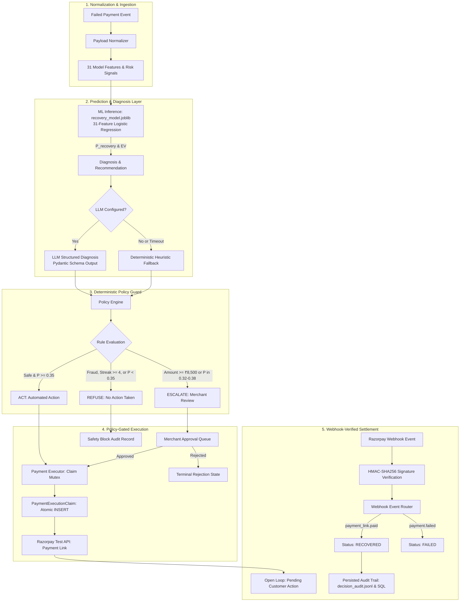

# RecoverAI — AI Revenue Recovery Agent

A policy-gated revenue recovery engine for e-commerce and subscription merchants. RecoverAI combines machine learning recovery scoring, Expected Value decision optimization, structured LLM failure diagnosis, deterministic safety controls, human approval workflows, and webhook-verified settlement.

---

[](https://www.python.org/)
[](https://fastapi.tiangolo.com/)
[](https://streamlit.io/)
[](https://github.com/langchain-ai/langgraph)
[](https://scikit-learn.org/)
[](https://razorpay.com/)
[-brightgreen.svg)]()

---

## The Problem

When a payment fails during checkout or recurring billing, merchants typically face two bad choices:

1. **Blind scheduled retries**: Retrying every failed payment regardless of failure cause burns gateway fees on permanent errors (e.g. invalid cards), exhausts customer retry limits, and annoys users.
2. **Manual follow-up**: Operations teams can rarely review failed payments in real time, leading to cart abandonment and involuntary churn.

In addition, standard recovery systems suffer from three specific flaws:
* **Unconstrained automation**: Allowing an automated system or language model to trigger payment actions on high-value orders without merchant approval creates financial risk.
* **Fraud vulnerability**: Retrying transactions that failed due to risk or suspicious velocity increases chargeback exposure.
* **Phantom revenue accounting**: Systems that treat payment-link creation as "recovered revenue" overstate performance before the customer has actually completed payment.

RecoverAI frames recovery as an optimization problem: estimate the probability of recovery for a specific failure, calculate whether an intervention has positive expected value after action fees, enforce strict safety rules before dispatching any payment action, and confirm settlement through webhooks.

---

## How RecoverAI Works



---

## Design Principles

The system architecture follows a clear separation of responsibility:

```text
ML predicts → LLM recommends → Deterministic policy decides → Human reviews escalations → Webhooks confirm settlement
```

* **ML predicts**: A calibrated classifier estimates recovery probability based on historical features.
* **LLM recommends**: A language model diagnoses failure causes and proposes recovery tactics. It has no direct tool-execution access.
* **Policy decides**: A deterministic policy engine applies non-overridable business rules. If a rule fails, the action is blocked regardless of what the LLM suggested.
* **Humans review escalations**: High-value transactions ($\ge ₹8,500$) and boundary cases pause for merchant review in an approval queue.
* **Webhooks confirm settlement**: Transactions are only marked recovered upon receiving a cryptographically verified webhook from Razorpay.

---

## Verified Offline Evaluation

Evaluated on the 15% holdout test dataset ($N = 633$ failed payments, stratified split, `random_state=42`):

| Metric | Reference Threshold ($\tau = 0.50$) | RecoverAI EV-Optimal ($\tau = 0.35$) | Net Business Improvement ($\Delta$) |
| :--- | :---: | :---: | :---: |
| **Total Revenue at Risk** | ₹1,579,773.01 | ₹1,579,773.01 | Total evaluatable failed transaction volume |
| **Interventions Selected** | 485 transactions ($76.6\%$) | **521 transactions ($82.3\%$)** | $+36$ additional recoverable orders captured |
| **Gross Recovered Revenue** | ₹889,907.57 | **₹920,754.44** | **$+₹30,846.87$ gross revenue uplift** |
| **Action Costs Incurred** | ₹4,117.00 | **₹4,189.00** | $+₹72.00$ incremental action cost |
| **Realized Net Recovery Value** | ₹885,790.57 | **₹916,565.44** | **$+₹30,774.87$ net value uplift (+1.95%)** |
| **Gross Risk Capture Rate** | 56.3% | **58.3%** | $+2.0\%$ absolute recovery capture |
| **Model Calibration** | Logistic Regression | EXP_0 Baseline Pipeline | Evaluated on holdout data |

> **Evaluation Methodology Note**: These figures are generated from offline holdout evaluation and Expected Value analysis on synthetic transaction logs (`data/raw/transactions.csv`). They represent modeled recovery outcomes based on simulated interventions and historical conversion distributions, not live merchant revenue results.

---

## Core Capabilities

### ML Prediction & Expected Value Optimization

The recovery decision uses an Expected Value (EV) calculation:

$$\text{EV} = P(\text{recovery}) \times \text{Amount} - \text{Action Cost}$$

Action costs reflect actual communication and gateway overhead (e.g. ₹5 for a payment link, ₹2 for a reminder, ₹0 for no action). By sweeping candidate thresholds $\tau$ across the development split, $\tau = 0.35$ was selected because it maximizes net recovery value: capturing borderline transactions where the payment amount justifies the small action cost.

#### Model Architecture and Artifact Roles

The repository maintains two serialized scikit-learn pipeline artifacts:

* **Production Runtime Model (`ml/models/recovery_model.joblib`)**:
  - **Inputs**: 31 approved features (amount, transaction history, customer success rate, failure streaks, IP risk, velocity scores, payment method, failure reason, and category).
  - **Pipeline**: `ColumnTransformer` with `StandardScaler` for numeric columns and `OneHotEncoder(handle_unknown="ignore")` for categoricals, followed by a calibrated `LogisticRegression`.
  - **Usage**: Powers the live LangGraph agent (`agent/nodes/prediction.py`), the REST API (`/api/v1/recovery`), and the demo simulator in the Streamlit dashboard.
* **Reference Baseline Model (`ml/models/experiments/exp_0_baseline.joblib`)**:
  - **Inputs**: 5 core features (`amount`, `hour`, `day_of_week`, `payment_method`, `failure_reason`).
  - **Pipeline**: Minimal `ColumnTransformer` and `LogisticRegression`.
  - **Usage**: Serves as the fixed reference baseline for offline Expected Value threshold optimization curves (`evaluation/business_metrics.py`), sensitivity stress tests (`evaluation/sensitivity_analysis.py`), and the macro KPI card in the Streamlit dashboard.

### Dual-Mode Diagnosis & Fallback

The diagnosis layer supports two execution modes:

* **LLM Mode**: When an API key is configured (`OPENAI_API_KEY` or `GROQ_API_KEY`), context is passed to the language model with strict Pydantic output schemas (`RecoveryDiagnosis`, `RecoveryRecommendation`). The model outputs root-cause explanations and suggested tactics.
* **Deterministic Fallback Mode**: If the API key is absent, times out, or returns a rate limit (HTTP 429), the node falls back to deterministic rule-based heuristics without halting the pipeline.

The language model has no tool-calling access to payment APIs. Its output is purely advisory to the policy layer.

### Deterministic Policy Guard

The policy guard (`agent/nodes/policy.py`) evaluates all transactions against deterministic rules before any action executes:

1. **REFUSE (Action Blocked)**:
   - Suspected fraud or risk failure (`failure_category == "risk_related"`, `failure_reason == "suspected_risk"`, or `ip_risk_score > 0.70`).
   - Permanent instrument failure (`invalid_card`, `card_expired`).
   - Failure streak limit (`consecutive_failure_streak >= 4`).
   - Sub-threshold probability ($P(\text{recovery}) < 0.35$).
2. **ESCALATE (Paused for Human Review)**:
   - High-value order ($\text{amount} \ge ₹8,500$).
   - Model uncertainty band ($0.32 \le P(\text{recovery}) \le 0.38$).
   - Risk velocity warning (`velocity_score > 0.65` and `ip_risk_score > 0.50`).
3. **ACT (Approved for Execution)**:
   - Transaction passes all refusal and escalation checks.

Fraud and permanent instrument blocks cannot be overridden through the approval queue.

### Human-in-the-Loop Review

Transactions that trigger an `ESCALATE` decision are written to the `approval_requests` database table with status `PENDING_APPROVAL`. 

* **Merchant Queue**: Operators review the order in the dashboard with access to the ML score, failure diagnosis, and triggered policy rules.
* **Concurrency Control**: Approvals use thread locks and database status checks. If two operators review the same transaction concurrently, the first resolution locks the state; the second attempt receives an HTTP 409 Conflict.
* **Terminal Rejection**: If rejected, the transaction enters `REJECTED_BY_MERCHANT` and zero payment actions are executed.

### Razorpay Settlement Verification

RecoverAI separates action initiation from recovery confirmation:

1. **Payment Link Dispatch**: When `ACT` is approved, the executor calls Razorpay's Test API to create a payment link. The database claim status is set to `PROCESSING`.
2. **Webhook Ingestion**: When the customer pays, Razorpay sends a `payment_link.paid` webhook to `/api/v1/webhooks/razorpay`.
3. **Cryptographic Validation**: The handler validates the signature against the webhook secret using `hmac.new(secret, raw_body, hashlib.sha256).hexdigest()`. Invalid signatures return HTTP 400.
4. **State Transition**: Only upon valid webhook receipt is the payment status updated to `RECOVERED`. This prevents payment-link creation from being counted as recovered revenue before settlement confirmation.

### Defensive PII Redaction

Before any payload is serialized into an LLM prompt (`agent/services/pii_redaction.py`):
* A deep copy of the context dictionary is created so the internal state is never mutated.
* Direct identity keys (`customer_email`, `customer_name`, `phone_number`, `address`) are stripped.
* Unstructured text fields are scanned with regex to mask email addresses (`[REDACTED_EMAIL]`), phone numbers (`[REDACTED_PHONE]`), and card PANs (`[REDACTED_CARD]`).
* Operational telemetry needed for diagnosis (`transaction_id`, `amount`, `failure_reason`, risk scores) is preserved.

---

## Demo Scenarios

The repository includes four pre-configured scenarios (`backend/routes/demo.py`) demonstrating policy boundary behaviors:

| Scenario | Name | Context & Signals | Expected Policy | Outcome |
| :--- | :--- | :--- | :---: | :--- |
| **Scenario A** | Smart Auto-Recovery | Network timeout, ₹2,500, high historical success rate, IP risk 0.04 | `ACT` | Payment link created; settles to `RECOVERED` on webhook |
| **Scenario B** | High-Value Approval | Network timeout, ₹14,500 ($\ge ₹8,500$ limit), IP risk 0.05 | `ESCALATE` | Enters merchant approval queue; requires human confirmation |
| **Scenario C** | Fraud Block | Suspected risk, ₹7,500, IP risk 0.92, velocity 0.85 | `REFUSE` | Hard block; no payment link; prohibited from approval queue |
| **Scenario D** | Low Probability Refusal | Bank decline, ₹3,200, Netbanking Axis, 0% historical success, velocity 0.85 | `REFUSE` | Blocked ($P < 0.35$); avoids spending action fee on unrecoverable payment |

---

## Integration Scope

| Component | Implementation Status | Scope & Environment |
| :--- | :--- | :--- |
| **Razorpay Payment Links** | Implemented | Real API calls using official Razorpay Python SDK in Test Mode |
| **Razorpay API Credentials** | Implemented | Requires `rzp_test_` key; live production keys (`rzp_live_`) are rejected by code validation |
| **Webhook Verification** | Implemented | Real HMAC-SHA256 signature verification on raw request body |
| **Webhook Delivery** | Dual-Mode | Supports live Razorpay webhooks and simulated local webhook injection for demos |
| **LLM Provider** | Dual-Mode | Real API integration with OpenAI / Groq; deterministic heuristic fallback if unconfigured |
| **Database Persistence** | Implemented | SQLAlchemy with SQLite default; compatible with PostgreSQL |
| **ML Training Data** | Synthetic | 20,000 synthetic transaction records calibrated to Indian fintech payment failure distributions |
| **Production Money Movement** | Not in Scope | Operates strictly in Test Mode / sandbox environments; no real customer funds are moved |

---

## Design Decisions & Trade-offs

1. **Separation of Recovery from Settlement**: Early prototypes marked payments as recovered upon successful generation of a payment link. Testing revealed this created phantom revenue when customers ignored links. The architecture was decoupled so payments only transition to `RECOVERED` after a verified `payment_link.paid` webhook arrives.
2. **LLM as Advisor, Not Controller**: Letting language models directly invoke payment APIs introduces hallucination risks on error handling. The LLM was restricted to structured failure diagnosis, placing all execution behind the deterministic policy layer.
3. **Idempotency Locking**: Rapid webhook retries or concurrent clicks can trigger duplicate payment links. RecoverAI uses database primary key constraints on `idempotency_key` combined with process-level thread locks, ensuring duplicate requests return the existing claim.
4. **Resilient Heuristic Fallbacks**: External LLM calls occasionally experience network timeouts or rate limits (HTTP 429). The system implements heuristic fallback routines so recovery evaluation continues uninterrupted even when external AI providers fail.
5. **Threshold Tuning**: Evaluating threshold sweeps on development data demonstrated that the default 0.50 cutoff left ₹30,846.87 in recoverable revenue unattempted. Lowering $\tau$ to 0.35 captured these transactions with an incremental action cost of only ₹72.00.

---

## Additional Evaluation

### Causal Treatment Effect Analysis (IPW)

To evaluate whether intervention lift is genuinely causal rather than purely observational, RecoverAI includes a Propensity Score Inverse Probability Weighting (IPW) analysis (`evaluation/causal_lift.py`):

* **Propensity Score Model**: Logistic regression estimating intervention probability $P(\text{treated} \mid \mathbf{X})$ across pre-treatment covariates, with weights clipped to $[0.01, 0.99]$.
* **IPW-Adjusted Average Treatment Effect (ATE)**: **+1.31 percentage points** (95% Bootstrap CI: **[-2.50%, +5.56%]** over 1,000 iterations, `seed=42`).
* **Methodological Scope**: Because the 95% bootstrap confidence interval spans zero, the treatment effect is not statistically distinguishable from zero in this offline benchmark. This analysis was conducted on synthetic historical logs and does not substitute for a live randomized A/B trial.

### Sensitivity & Stress Testing

The threshold policy was evaluated across 6 stress scenarios (`evaluation/sensitivity_analysis.py`) varying failure reason distributions, action costs, and payment method mixes. Across all scenarios, the EV-optimized policy maintained positive net recovery value relative to the zero-intervention baseline.

---

## Technology Stack

* **Runtime**: Python 3.10+
* **Workflow Orchestration**: LangGraph (`StateGraph`)
* **Machine Learning**: scikit-learn (`Pipeline`, `ColumnTransformer`, `LogisticRegression`)
* **API Backend**: FastAPI, Pydantic v2, Uvicorn
* **Database & Persistence**: SQLAlchemy (SQLite default, PostgreSQL compatible)
* **Payment Integration**: Razorpay Python SDK, HMAC-SHA256 webhook verification
* **Dashboard**: Streamlit
* **Testing**: Pytest, FastAPI TestClient

---

## Project Structure

```text
RecoverAI/
├── agent/            # LangGraph workflow, policy engine, and decision nodes
│   ├── nodes/        # Prediction, diagnosis, policy guard, and verification nodes
│   ├── services/     # LLM service and PII redaction layer
│   └── graph.py      # Compiled StateGraph assembly and routing
├── backend/          # FastAPI REST API application and route handlers
│   └── routes/       # Recovery, approvals, demo, and webhook endpoints
├── database/         # SQLAlchemy models, repositories, and session management
├── evaluation/       # Expected Value optimization, causal lift, and stress tests
├── frontend/         # Streamlit Command Center dashboard
├── ml/               # Model training, feature pipelines, and serialized artifacts
│   └── models/       # recovery_model.joblib and exp_0_baseline.joblib
├── monitoring/       # Population Stability Index (PSI) feature drift detection
├── payment/          # Razorpay client wrapper, execution engine, and webhooks
├── policies/         # Frozen operational policy configuration
└── tests/            # Automated test suite (158 passing tests)
```

---

## Running Locally

### 1. Environment Setup
```bash
# Clone repository
git clone https://github.com/Aashi0105/RecoverAI.git
cd "RecoverAI — AI Revenue Recovery Agent"

# Create and activate virtual environment
python -m venv venv
# Windows:
.\venv\Scripts\Activate.ps1
# Linux / macOS:
source venv/bin/activate

# Install dependencies
pip install -r requirements.txt

# Configure environment variables
cp .env.example .env
```

### 2. Launch Streamlit Dashboard
```bash
streamlit run frontend/app.py
# Open http://localhost:8501
```

### 3. Launch FastAPI Backend (Optional)
```bash
uvicorn backend.main:app --reload --port 8000
# API documentation available at http://localhost:8000/docs
```

---

## Automated Testing

The repository maintains an automated test suite verifying policy invariants, ML schemas, idempotency concurrency, PII redaction, and webhook signatures.

```bash
pytest tests/ -v
```

**Verified Test Summary**: 158 passed across 21 test files (100% pass rate).

---

## License & Acknowledgements

* Developed for the **Razorpay AI Buildathon**.
* Built using the **Razorpay Python SDK**, **LangGraph**, **FastAPI**, **scikit-learn**, and **Streamlit**.
